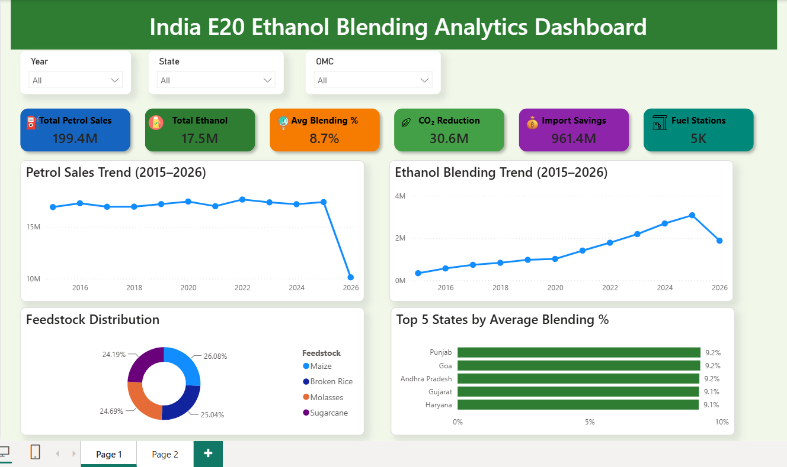

# 🇮🇳 India E20 Ethanol Blending Analytics Dashboard

An interactive **Power BI Dashboard** built to analyze India's **E20 Ethanol Blending Program (2015–2026)**. This project provides insights into ethanol production, blending performance, CO₂ emission reduction, fuel station distribution, and import savings through dynamic and interactive visualizations.

---

## 📌 Project Overview

The Government of India's **E20 Ethanol Blending Program** aims to increase ethanol blending with petrol to reduce crude oil imports, lower carbon emissions, and strengthen energy security.

This dashboard transforms raw data into meaningful business insights using **Power BI**, enabling users to monitor trends, compare performance across states and Oil Marketing Companies (OMCs), and evaluate the impact of ethanol blending.

---

# 📷 Dashboard Screenshots

## 🏠 Dashboard Overview (Page 1)



### This page includes:

- KPI Cards
  - Total Petrol Sales
  - Total Ethanol Production
  - Average Blending %
  - CO₂ Reduction
  - Import Savings
  - Fuel Stations

- Petrol Sales Trend (2015–2026)

- Ethanol Blending Trend (2015–2026)

- Feedstock Distribution

- Top 5 States by Average Blending %

---

## 📊 Advanced Analytics (Page 2)


### This page includes:

- Top 5 States by Petrol Sales

- CO₂ Reduction Trend

- Import Savings Trend

- Total Ethanol by Oil Marketing Company (IOC, HPCL, BPCL)

---

# 🎯 Project Objectives

- Analyze India's ethanol production trends.
- Monitor E20 blending performance.
- Compare state-wise petrol sales.
- Study ethanol feedstock distribution.
- Evaluate CO₂ emission reduction.
- Analyze import savings achieved through ethanol blending.
- Compare Oil Marketing Company (OMC) performance.
- Build an interactive business intelligence dashboard.

---

# 📊 Dashboard Features

✅ Interactive Slicers (Year, State, OMC)

✅ KPI Cards

✅ Dynamic Charts

✅ Trend Analysis

✅ State-wise Insights

✅ Feedstock Analysis

✅ Import Savings Analysis

✅ CO₂ Reduction Monitoring

✅ Business-friendly Dashboard Design

---

# 📈 Key Insights

- Ethanol blending has steadily increased over the years.
- Import savings improved significantly with higher ethanol blending.
- CO₂ emissions reduced as blending percentages increased.
- Sugarcane, maize, molasses, and broken rice contribute significantly to ethanol production.
- Top-performing states consistently maintain higher blending percentages.
- IOC, HPCL, and BPCL show comparable blending performance.

---

# 🛠 Tools & Technologies

- Microsoft Power BI
- Power Query
- DAX
- Data Modeling
- Data Cleaning
- Interactive Dashboards
- Business Intelligence
- Data Visualization

---

# 📂 Repository Structure

```

India-E20-Ethanol-PowerBI-Dashboard
│
├── Dashboard
│ └── E20 Powerbi Dashboard.pbix
│
├── Dataset
│ └── E20_Synthetic_Dashboard_Dataset_2015_2026.csv
│
├── Images
│ ├── dashboard-page1.png
│ └── dashboard-page2.png
│
├── README.md
├── LICENSE
└── .gitignore

```

---

# 📊 Dataset

The dataset contains:

- Year
- State/UT
- Oil Marketing Company (OMC)
- Petrol Sales
- Ethanol Production
- Average Blending %
- Feedstock
- Fuel Stations
- Import Savings
- CO₂ Reduction

---

# 💼 Skills Demonstrated

- Data Cleaning
- Data Transformation
- Data Modeling
- DAX Calculations
- Power Query
- Interactive Dashboard Design
- KPI Development
- Business Intelligence
- Data Storytelling
- Data Visualization

---

# 🚀 Future Improvements

- Power BI Service Deployment
- Mobile Dashboard Layout
- Forecasting using AI Visuals
- Additional Sustainability KPIs
- Drill-through Reports
- Real-time Data Integration

---

# ⭐ Why This Project?

This dashboard demonstrates how Power BI can be used to transform raw energy-sector data into actionable insights through interactive visualizations and business-focused reporting.

It showcases skills in dashboard development, data modeling, DAX, Power Query, and data storytelling.

---

# 📬 Connect With Me

**LinkedIn:** [https://www.linkedin.com/in/your-profile](https://www.linkedin.com/in/kotra-chandra-prakash)

**GitHub:** [https://github.com/your-username](https://github.com/Chandu20036)

---

## ⭐ If you found this project helpful, please give it a Star!

Thank you for visiting this repository.

---

## 📄 License

This project is licensed under the MIT License.
